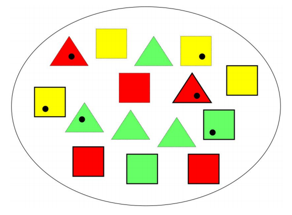
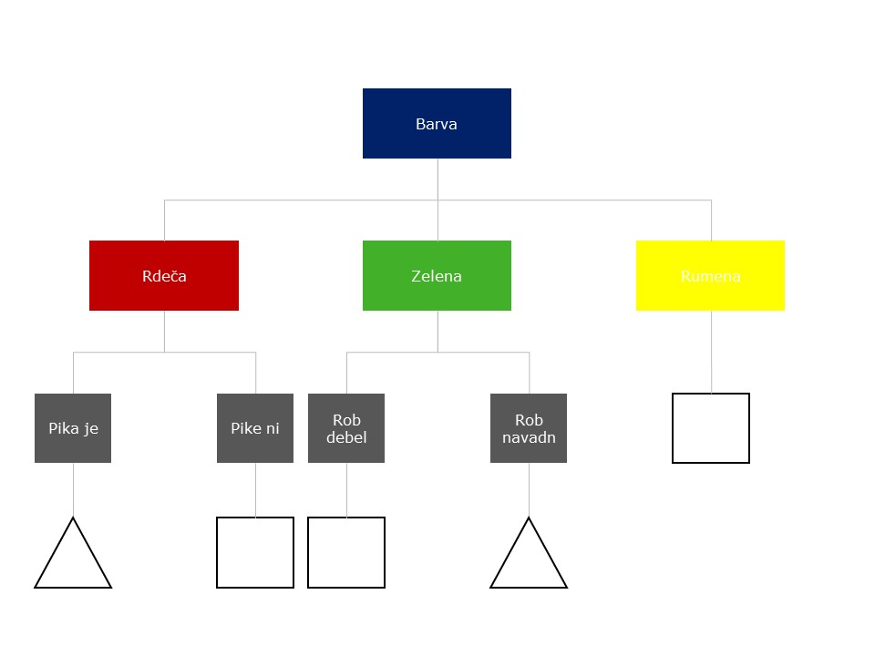

```{r setup, include=FALSE}
knitr::opts_chunk$set(echo = TRUE)
```
# UVOD
Za spodnje podatke zgradimo celotno drevo z izračunom IG. Naš razred je oblika, napovedujemo jo   na podlagi barve, roba in pike. Sledimo postopku v knjigi in iščemo največji IG.

# PODATKI
```{r echo=FALSE, out.width='60%'}

```

# 1. NIVO

## Začetna nečistost
$I(oblika) = -\frac{6}{15}\log_2{\frac{6}{15}}-\frac{9}{15}\log_2{\frac{9}{15}}=0.971$

## Barva
- Rdeča $2\triangle, 3 \square$: $I(rdeča) = -\frac{2}{5}\log_2{\frac{2}{5}}-\frac{3}{5}\log_2{\frac{3}{5}}=0.971$
- Zelena $4\triangle, 2 \square$: $I(zelena) = -\frac{4}{6}\log_2{\frac{4}{6}}-\frac{2}{6}\log_2{\frac{2}{6}}=0.918$
- Rumena $0\triangle, 4 \square$: $I(rumena) = -\frac{0}{4}\log_2{\frac{0}{4}}-\frac{4}{4}\log_2{\frac{4}{4}}=0$

$I_{res}(barva)=\frac{5}{15}I(rdeča)+\frac{6}{15}I(zelena)+\frac{4}{15}I(rumena)=0.691$

$IG(barva)=I(oblika) - I_{res}(barva)=0.28$

## Rob
- Debel $1\triangle, 6 \square$: $I(debel) = -\frac{1}{7}\log_2{\frac{1}{7}}-\frac{6}{7}\log_2{\frac{6}{7}}=0.592$
- Navaden $5\triangle, 3 \square$: $I(navaden) = -\frac{5}{8}\log_2{\frac{5}{8}}-\frac{3}{8}\log_2{\frac{3}{8}}=0.954$

$I_{res}(rob)=\frac{7}{15}I(debel)+\frac{8}{15}I(navaden)=0.785$

$IG(rob)=I(oblika) - I_{res}(rob)=0.186$

## Pika
- Ja $3\triangle, 3 \square$: $I(ja) = -\frac{3}{6}\log_2{\frac{3}{6}}-\frac{3}{6}\log_2{\frac{3}{6}}=1$
- Ne $3\triangle, 9 \square$: $I(ne) = -\frac{3}{9}\log_2{\frac{3}{9}}-\frac{6}{9}\log_2{\frac{6}{9}}=0.918$

$I_{res}(pika)=\frac{6}{15}I(ja)+\frac{9}{15}I(ne)=0.951$

$IG(pika)=I(oblika) - I_{res}(pika)=0.02$
Najvišji IG ima barva zato najprej izberemo to spremenljivko. Sedaj naprej gradimo drevo iz posamezne barve.

# 2. NIVO

## 1. Rdeča
### Začetna nečistost
Dobimo jo zgoraj poračunanih vrednosti
$I(oblika) = 0.971$

### Rob
- Debel $1\triangle, 2 \square$: $I(rdeča) = -\frac{1}{3}\log_2{\frac{1}{3}}-\frac{2}{3}\log_2{\frac{2}{3}}=0.918$
- Navaden $1\triangle, 1 \square$: $I(zelena) = -\frac{1}{2}\log_2{\frac{1}{2}}-\frac{1}{2}\log_2{\frac{1}{2}}=1$

$I_{res}(rob)=\frac{3}{5}I(debel)+\frac{2}{5}I(navaden)=0.951$

$IG(rob)=I(oblika) - I_{res}(rob)=0.02$

### Pika
- Ja $2\triangle, 0 \square$: $I(rdeča) = -\frac{2}{2}\log_2{\frac{2}{2}}-\frac{0}{2}\log_2{\frac{0}{2}}=0$
- Ne $0\triangle, 3 \square$: $I(zelena) = -\frac{0}{3}\log_2{\frac{0}{3}}-\frac{3}{3}\log_2{\frac{3}{3}}=0$

$I_{res}(pika)=\frac{2}{5}I(ja)+\frac{3}{5}I(ne)=0$

$IG(pika)=I(oblika) - I_{res}(pika)=0.971$

Pri rdeči izberemo piko, če je pika potem je trikotnik, če ni je kvadrat.

## 2. Zelena
### Začetna nečistost
$I(oblika) = 0.918$

### Rob
- Debel $0\triangle, 2 \square$: $I(rdeča) = -\frac{0}{2}\log_2{\frac{0}{2}}-\frac{2}{2}\log_2{\frac{2}{2}}=0$
- Navaden $4\triangle, 0 \square$: $I(zelena) = -\frac{4}{4}\log_2{\frac{4}{4}}-\frac{0}{4}\log_2{\frac{0}{4}}=0$

$I_{res}(rob)=\frac{2}{6}I(debel)+\frac{4}{6}I(navaden)=0$

$IG(rob)=I(oblika) - I_{res}(rob)=0.918$

### Pika
- Ja $1\triangle, 1 \square$: $I(rdeča) = -\frac{1}{2}\log_2{\frac{1}{2}}-\frac{1}{2}\log_2{\frac{1}{2}}=1$
- Ne $3\triangle, 1 \square$: $I(zelena) = -\frac{3}{4}\log_2{\frac{3}{4}}-\frac{0}{1}\log_2{\frac{1}{4}}=0.811$

$I_{res}(pika)=\frac{2}{6}I(ja)+\frac{4}{6}I(ne)=0.874$

$IG(pika)=I(oblika) - I_{res}(pika)=0.044$

Pri zeleni izberemo rob, če je debel rob potem je kvadrat, če je navaden rob je trikotnik.

## 3. Rumena
### Začetna nečistost
$I(oblika) = 0$

Tukaj smo že priški do lista, torej če je rumen je kvadrat.

# DREVO
```{r echo=FALSE, out.width='80%'}

```
